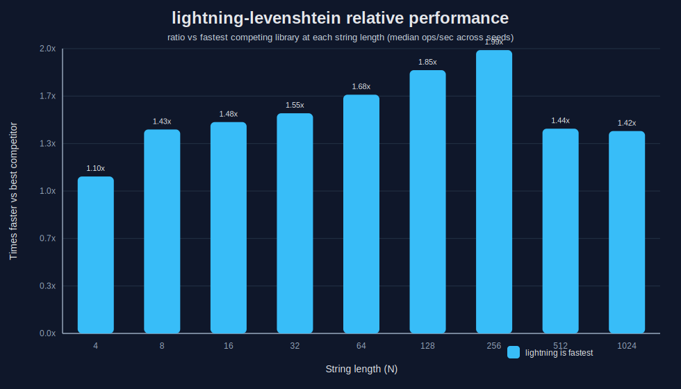
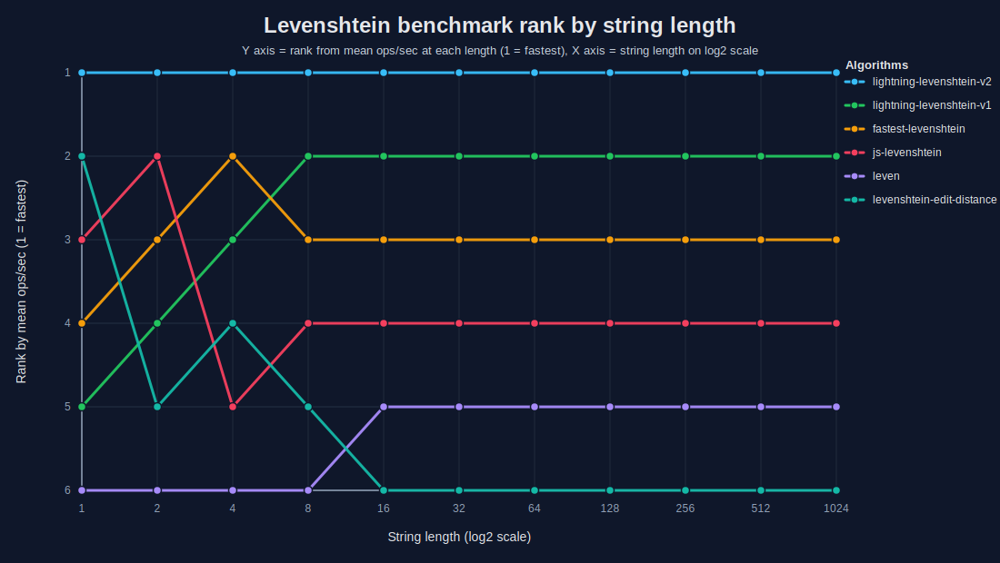

# ⚡ lightning-levenshtein

Fast Levenshtein distance in pure JavaScript.

`lightning-levenshtein` uses tiny-string specializations, precompiled 32-bit kernels, fixed-width Myers variants, and a generalized large-input fallback to deliver high throughput across the full input range.

## Installation

```bash
npm install lightning-levenshtein
```
## npm package contents

The published package includes two production builds:

```text
dist/
  lightning-levenshtein.min.js
  lightning-levenshtein-v2.min.js
```

### Default API

The default package entrypoint exposes the stable core API:

```js
import { distance, distanceMax, closest } from "lightning-levenshtein";
```

This resolves to `dist/lightning-levenshtein.min.js`.

### V2 API

A second public subpath export is also available:

```js
import { levenshteinLightning } from "lightning-levenshtein/v2";
```

This resolves to `dist/lightning-levenshtein-v2.min.js`.

The `v2` build is a separate optimized runtime that uses more aggressive length-based dispatch, tiny-string fast paths, precompiled 32-bit kernels, fixed-width Myers variants, and a generalized large-input fallback. It is not just a renamed copy of the default package entrypoint.

### Which one should users pick?

Use the default package entrypoint if you want the stable general-purpose npm API:

```js
import { distance, distanceMax, closest } from "lightning-levenshtein";
```

Use the `v2` subpath if you specifically want the specialized `levenshteinLightning` runtime:

```js
import { levenshteinLightning } from "lightning-levenshtein/v2";
```

### Current package exports

The package currently exposes both entrypoints through `exports`:

```json
{
  "exports": {
    ".": "./dist/lightning-levenshtein.min.js",
    "./v2": "./dist/lightning-levenshtein-v2.min.js"
  }
}
```

## What it does

* Specialized kernels for very short strings
* Precompiled bit-parallel dispatch for short inputs
* Fixed-width Myers variants for medium inputs
* Generalized Myers fallback for large inputs
* Zero runtime dependencies
* Works in Node.js and browsers

## Strategy

The runtime selects the cheapest correct kernel for the current input size.

* **1–32 chars:** precompiled bit-parallel kernels
* **33–64 chars:** fixed-width Myers specialization
* **65–96 chars:** fixed-width Myers specialization
* **97–128 chars:** fixed-width Myers specialization
* **129–224 chars:** generalized macro-block Myers dispatch
* **225–256 chars:** fixed-width Myers specialization
* **257–512 chars:** generalized macro-block Myers dispatch
* **513+ chars:** large-input generalized Myers dispatch

This keeps tiny inputs fast without sacrificing larger-input performance.

## Benchmark

The benchmark harness generates the same string pairs for every library at each tested length and seed.

Benchmarks were run in Node.js:

- **Node version:** `v24.11.0`


### Methodology

* 500 random equal-length string pairs per test size
* 3 seeds: `1337`, `7331`, `20250321`
* 500 ms measurement window per seed
* 3 warm-up rounds before timing
* alphabet: `A-Z`, `a-z`, `0-9`
* reported table values: **mean ops/ms across 3 seeds**

### Mean ops/sec

| Test Target | N=1 | N=2 | N=4 | N=8 | N=16 | N=32 | N=64 | N=128 | N=256 | N=512 | N=1024 |
|---|---:|---:|---:|---:|---:|---:|---:|---:|---:|---:|---:|
| lightning-levenshtein-v2 | 180629 | 91386 | 50257 | 32369 | 11949 | 6514 | 1805 | 581.9 | 158.0 | 35.92 | 9.327 |
| lightning-levenshtein-v1 | 94625 | 61719 | 40905 | 25507 | 8577 | 4938 | 1224 | 466.0 | 134.5 | 35.25 | 9.117 |
| fastest-levenshtein | 100634 | 74359 | 43909 | 23150 | 8307 | 4240 | 1087 | 290.2 | 78.41 | 19.55 | 5.092 |
| js-levenshtein | 115773 | 87076 | 23668 | 11343 | 3373 | 924.0 | 241.7 | 61.35 | 15.92 | 3.985 | 1.006 |
| leven | 82490 | 41685 | 21482 | 8188 | 1785 | 420.2 | 114.2 | 29.90 | 7.607 | 1.913 | 0.481 |
| levenshtein-edit-distance | 114674 | 55327 | 24957 | 8463 | 1792 | 396.6 | 106.6 | 27.38 | 6.992 | 1.754 | 0.438 |


### Relative throughput vs `fastest-levenshtein`

This chart normalizes `fastest-levenshtein` to **100% at each string length** and shows every other library relative to that baseline.

Use this graph when you want an apples-to-apples comparison against the package most people already know. Values above 100% mean faster than `fastest-levenshtein`; values below 100% mean slower.


### Throughput across input sizes

Mean ops/sec shown on a log-scaled Y axis across the full tested range.


### Relative throughput vs `fastest-levenshtein`

This chart normalizes `fastest-levenshtein` to **100% at each string length** and shows `lightning-levenshtein` relative to that fixed baseline.

We use `fastest-levenshtein` as the canonical public reference point because it is a widely recognized JavaScript Levenshtein implementation. Values above 100% mean faster than `fastest-levenshtein`; values below 100% mean slower.



---

### Rank by input length

This chart shows where each library ranks at each tested string length.

This is useful because raw throughput can be noisy to read at a glance, while rank makes the ordering obvious. If a library is consistently ranked first across the range, you can see that immediately without squinting at the absolute numbers.



## Results

* `lightning-levenshtein` is the fastest library in this benchmark set at every tested length.
* It leads at `N=1`, `N=2`, `N=4`, `N=8`, `N=16`, `N=32`, `N=64`, `N=128`, `N=256`, `N=512`, and `N=1024`.
* At `N=1024`, mean throughput is **9.36 ops/ms** versus **4.98 ops/ms** for `fastest-levenshtein`.
* At `N=32`, mean throughput is **6568 ops/ms** versus **4240 ops/ms** for `fastest-levenshtein`.
* At `N=8`, mean throughput is **33126 ops/ms** versus **23288 ops/ms** for `fastest-levenshtein`.

## Reproducing the benchmark

```bash
npm run bench:packages
npm run bench:packages:table
npm run bench:packages:chart
```

Generated files are written to `bench/packages/`.

## Project layout

```text
bench/bolt/
  lev-dispatch.js
  levenshtein-lightning-v2.js
  levenshtein_Direct_Matrix.js
  myers32_v4.js
  myers_64.js
  myers_96.js
  myers_128.js
  myers_256.js
  myers_x.js
  myers_x64.js

bench/packages/
  run-bench.js
  render-readme-table.js
  render-readme-line-chart.js
  render-readme-rank-chart.js
  render-relative-bar-chart.js
  render-readme-relative-fastest-chart.js
  results.json
```

## License

See `LICENSE.md`.
