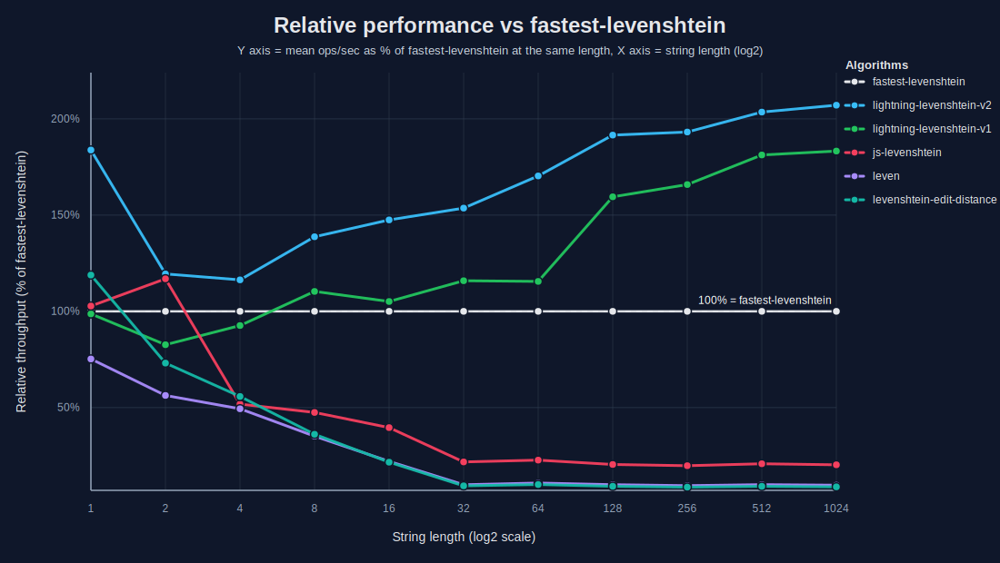
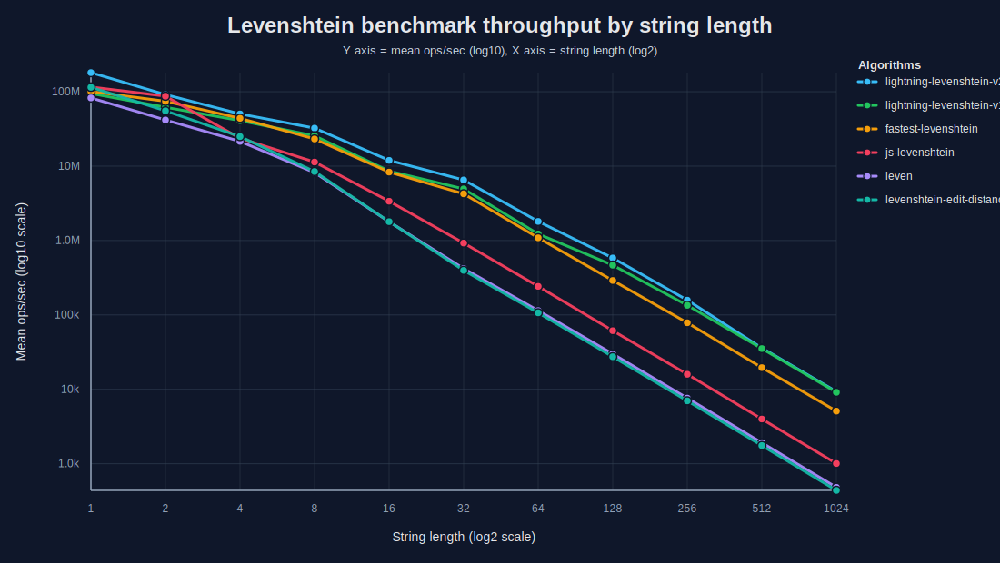

# ⚡ lightning-levenshtein

Fast Levenshtein distance in pure JavaScript.

`lightning-levenshtein` uses tiny-string specializations, precompiled 32-bit kernels, fixed-width Myers variants, and a generalized large-input fallback to deliver high throughput across the full input range.

## Installation

```bash
npm install lightning-levenshtein
```

## What it does

* Specialized kernels for very short strings
* Precompiled bit-parallel dispatch for short inputs
* Fixed-width Myers variants for medium inputs
* Generalized Myers fallback for large inputs
* Zero runtime dependencies
* Works in Node.js and browsers

## Strategy

The runtime selects the cheapest correct kernel for the current input size.

* **1–4 chars:** direct specialized dispatch
* **5–32 chars:** precompiled bit-parallel kernels
* **33–64 chars:** 64-bit-width specialization
* **65–96 chars:** 96-bit-width specialization
* **97–128 chars:** 128-bit-width specialization
* **129–256 chars:** 256-bit-width specialization
* **257+ chars:** generalized Myers fallback

This keeps tiny inputs fast without sacrificing larger-input performance.

## Benchmark

Benchmarks use the same generated dataset for every library.

### Methodology

* 500 random equal-length string pairs per test size
* 3 seeds: `1337`, `7331`, `20250321`
* 500 ms measurement window per seed
* 3 warm-up rounds before timing
* alphabet: `A-Z`, `a-z`, `0-9`
* reported table values: **median ops/sec across seeds**

### Median ops/sec

| Library                   |       N=1 |      N=2 |      N=4 |      N=8 |     N=16 |    N=32 |    N=64 |  N=128 |  N=256 | N=512 | N=1024 |
| ------------------------- | --------: | -------: | -------: | -------: | -------: | ------: | ------: | -----: | -----: | ----: | -----: |
| lightning-levenshtein     | 185534889 | 88970039 | 47915061 | 33126152 | 12010539 | 6568423 | 1790702 | 574413 | 155690 | 35836 |   9360 |
| fastest-levenshtein       |  99195484 | 74593269 | 44281176 | 23288204 |  8121555 | 4239672 | 1087882 | 299694 |  78298 | 19392 |   4975 |
| js-levenshtein            | 117858034 | 87952842 | 23753040 | 11365064 |  3371731 |  922209 |  242691 |  62090 |  15934 |  4012 |   1008 |
| leven                     |  82575042 | 41294182 | 21579827 |  8142399 |  1799231 |  417973 |  113628 |  29804 |   7607 |  1905 |    480 |
| levenshtein-edit-distance | 115678422 | 56163472 | 24884806 |  8474653 |  1804582 |  396584 |  106452 |  27466 |   6992 |  1757 |    438 |

### Relative throughput vs `fastest-levenshtein`

`fastest-levenshtein` is normalized to **100%** at each string length.



### Throughput across input sizes

Mean ops/sec shown on a log-scaled Y axis across the full tested range.



## Results

* `lightning-levenshtein` is the fastest library in this benchmark set at every tested length.
* It leads at `N=1`, `N=2`, `N=4`, `N=8`, `N=16`, `N=32`, `N=64`, `N=128`, `N=256`, `N=512`, and `N=1024`.
* At `N=1024`, median throughput is **9360 ops/sec** versus **4975 ops/sec** for `fastest-levenshtein`.
* At `N=32`, median throughput is **6568423 ops/sec** versus **4239672 ops/sec** for `fastest-levenshtein`.
* At `N=8`, median throughput is **33126152 ops/sec** versus **23288204 ops/sec** for `fastest-levenshtein`.

## Reproducing the benchmark

```bash
npm run bench:packages
npm run bench:packages:table
npm run bench:packages:chart
```

Generated files are written to `bench/packages/`.

## Project layout

```text
bench/bolt/
  lev-dispatch.js
  levenshtein-lightning-v2.js
  levenshtein_Direct_Matrix.js
  myers32_v4.js
  myers_64.js
  myers_96.js
  myers_128.js
  myers_256.js
  myers_x.js
  myers_x64.js

bench/packages/
  run-bench.js
  render-readme-table.js
  render-readme-chart.js
  render-readme-line-chart.js
  render-readme-relative-fastest-chart.js
  results.json
```

## License

See `LICENSE.md`.
